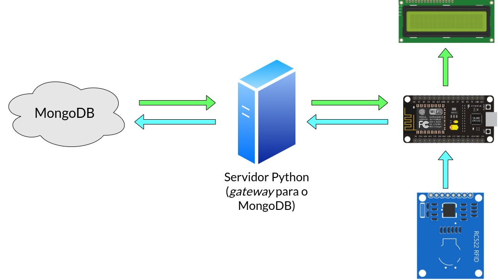
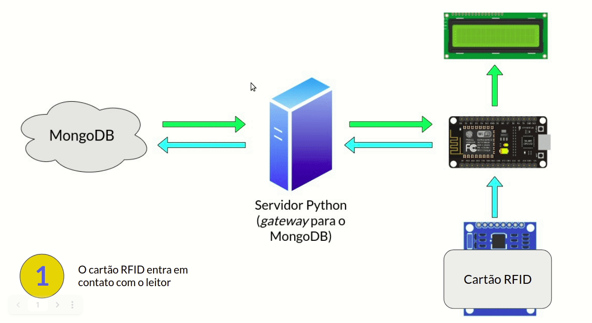
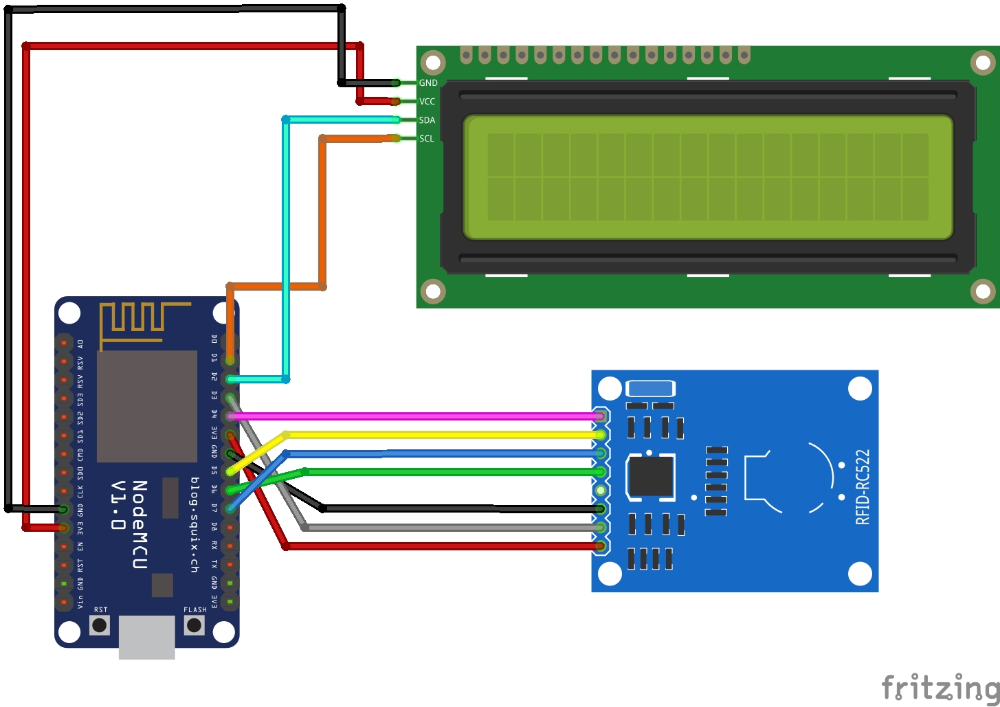
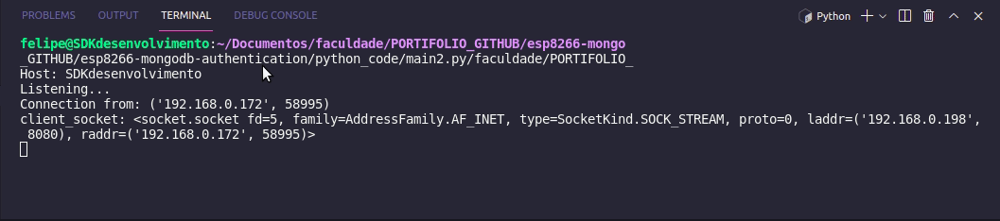
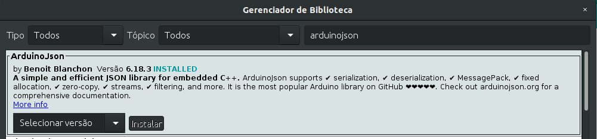

<h1 align="center">
    
</h1>

# ESP8266 e MongoDB: Projeto de autenticação de IDs

Um pequeno projeto de IoT que exemplifica o uso de MongoDB junto com esp8266, isto é, a conexão entre os dois e a autenticação de chaves.

<p>
    
    
    
</p>

Tabela de conteúdos
=================
- [Objetivo](#objetivo)
- [Funcionamento/Desenvolvimento](#funcionamento-desenvolvimento)
  * [Diagrama da aplicação](#diagrama-da-aplicação)
  * [Esquemático da parte eletrônica](#esquemático-da-parte-eletrônica)
  * [Gerando perfis aleatórios com o módulo ```Faker``` do Python](#gerando-perfis-aleatórios-com-o-módulo-faker-do-python)
  * [Desenvolvimento em C++ - Dispositivo IoT com o esp8266](#desenvolvimento-em-c-----dispositivo-iot-com-o-esp8266)
  * [Desenvolvimento em Python - Gateway para o MongoDB](#desenvolvimento-em-python---gateway-para-o-mongodb)
- [Demonstração](#demonstração)
- [Pré-requisitos](#pré-requisitos)
- [Observações](#observações)
  * [A questão da classe ```String``` do Arduino](#a-questão-da-classe-string-do-arduino)
  * [Por que não conectar o microcontrolador diretamente ao banco de dados?](#por-que-não-conectar-o-microcontrolador-diretamente-ao-banco-de-dados-)
  * [Esse é um exemplo simples](#esse-é-um-exemplo-simples)
- [Tecnologias utilizadas](#tecnologias-utilizadas)
- [Autor](#autor)
- [Licença](#licença)

<small><i><a href='http://ecotrust-canada.github.io/markdown-toc/'>Table of contents generated with markdown-toc</a></i></small>


## Objetivo

O objetivo do projeto é demonstrar a conexão entre um microcontrolador (esp8266) e um banco de dados noSQL (MongoDB) mediante um gateway (em Python).

A motivação disso é exemplificar como pode ser feita a autenticação de chaves de identificação e/ou perfis de usuário utilizando buscas em banco de dados.

Esse conhecimento pode ser usado no desenvolvimento de sistemas embarcados com aplicações nas mais diversas áreas, como em sistemas controle de acesso e prontuários médicos eletrônicos, por exemplo. 

Para facilitar a compreensão (e contextualização do projeto), elaborou-se uma situação na qual os conceitos podem ser aplicados. 

O projeto consiste em um sistema de controle de acesso de funcionários em uma empresa fictícia, cuja identificação é mediante um cartão RFID. A autenticação ocorre ao cruzar o ID com o perfil salvo no banco de dados. A interface de usuário é apresentada em um display LCD.

## Funcionamento/Desenvolvimento

### Diagrama da aplicação

Em linhas gerais, o funcionamento do projeto é o seguinte: 

0. **_Considerando a conexão entre as partes já estabilizada:_**
    * _Conexão wifi (socket TCP) entre servidor (gateway Python) e esp8266;_
    * _Conexão entre gateway e MongoDB estabilizada (na porta 27017);_

1. **O cartão RFID entra em contato com o leitor;**
2. **O ID é lido e processado para ser enviado ao servidor Python;**
3. **O ID é enviado ao gateway, na forma de string, por meio de um socket wifi;**
4. **A aplicação Python faz a busca, no banco de dados, do perfil correspondente ao ID lido;**
5. **O MongoDB responde a requisição com o perfil encontrado;**
6. **O gateway Python filtra as informações recebidas e envia para o esp8266 apenas o essencial;**
7. **O microcontrolador recebe os valores do JSON e os printa na tela do display LCD.**

Esses passos podem ser melhor visualizados no diagrama animado abaixo.



Nessa imagem, foi representado um banco de dados na nuvem, embora tenha sido usado um servidor local MongoDB para o projeto.

Isso foi feito para representar a adaptabilidade deste projeto a diversos cenários: é possível ter um servidor MongoDB local (_on-premisse_), ou na nuvem, via [MongoDB Atlas](https://www.mongodb.com/cloud/atlas). É possível, ainda, utilizar uma alternativa noSQL de uma plataforma de Cloud, como o [Google Cloud Bigtable](https://cloud.google.com/bigtable) (ideal para IoT), por exemplo.

### Esquemático da parte eletrônica

Para a situação deste projeto, pensei em me basear em um sistema embarcado de controle de acesso comum à ambientes corporativos, tal qual uma [catraca](https://www.topdata.com.br/catracas/) ou algo semelhante. 

Além disso, também era necessário utilizar módulos que eu tinha disponíveis em casa, e os melhores para essa situação eram o [leitor RFID MFRC522](https://www.filipeflop.com/produto/kit-modulo-leitor-rfid-mfrc522-mifare/) e o [display LCD I2C](https://www.filipeflop.com/produto/display-lcd-16x2-i2c-backlight-azul/).

Digo isso pois, como o objetivo é autenticar um ID em um banco de dados remoto, é possível combinar diversos módulos e tecnologias, utilizando uma API comum. Por exemplo, podem ser usados outros modos de identificação, como um [leitor de impressão digital](https://www.filipeflop.com/produto/modulo-leitor-de-impressao-digital/). Além disso, também podem ser usados outros displays, como o [OLED](https://www.filipeflop.com/produto/display-oled-0-96-polegadas-i2c-branco/), [LCD Nokia](https://www.filipeflop.com/produto/display-lcd-nokia-5110/), [TFT colorido](https://www.filipeflop.com/produto/display-lcd-tft-3-2-240x320/), [e-Paper](https://www.filipeflop.com/produto/modulo-display-e-paper-2-9-296x128/), ou até uma [interface web](https://realtimelogic.com/articles/Embedded-Web-Server-Tutorials).

Sendo assim, o esquemático da parte física do projeto é apresentado na imagem abaixo. 



Os detalhes de conexão são:

**Display LCD I2C:**
- SCL ⮕ D1
- SDA ⮕ D2
- VCC ⮕ VCC (qualquer um)
- GND ⮕ GND (qualquer um)

**Leitor RFID:**
- RST ⮕ D3
- MISO ⮕ D6
- MOSI ⮕ D7
- SCK ⮕ D5
- SDA ⮕ D4
- VCC ⮕ VCC (qualquer um)
- GND ⮕ GND (qualquer um)

Para mais detalhes, consulte o arquivo com o [esquemático](assets/esquematico.fzz) (Fritzing).

### Gerando perfis aleatórios com o módulo ```Faker``` do Python

Para que o projeto pudesse ser testado, era necessário ter perfis de supostos funcionários salvos no banco de dados. Eu poderia ter feito isso manualmente, mas eu resolvi, para essa situação, testar um módulo Python que eu descobri recentemente e estava muito ansioso em usar: o ```Faker```.

[Faker](https://faker.readthedocs.io/en/master/) é uma biblioteca que gera dados falsos de perfis (e de outras coisas), de forma aleatória, a partir de um banco de dados interno. É muito usada para popular bancos de dados para testes, pois permite gerar uma grande quantidade de dados (que fazem sentido) com um script simples.

Seguindo essa lógica, utilizei o ```Faker``` para gerar perfis para o meu banco de dados, de forma rápida. A única intervenção que tive que fazer foi inserir o ID dos cartões RFID em cada um; claro, pois é por meio dessas chaves que os perfis serão encontrados. Como eu só tenho 3 cartões RFID, só pude criar 3 perfis.

O código está na pasta [profiles_generator](profiles_generator/), e funciona (**resumidamente**) conforme o bloco abaixo:
```python
#Instanciando classe Faker (em português)
faker = Faker('pt-BR')

#(...)

#IDs dos cartões que eu tenho
ids = ['17 16 52 D3',
        'C6 B5 BD 1A',
        'D6 29 6A 1A']

#Gerando perfis iteerativamente
for i in range(len(ids)):
    # Gera um perfil completo
    humano = faker.profile()

    # Adiciona um ID ao perfil
    humano['ID'] =  ids[i]

    #Insere no MongoDB
    col.insert(humano)
```

No meu caso, os perfis gerados foram estes (resumidamente):
```js
{'job': 'Mensageiro', 'name': 'Maria Alice Fogaça'}
{'job': 'Percursionista', 'name': 'Luna Moreira'}
{'job': 'Cadeirinha', 'name': 'Arthur Azevedo'} //Embora eu não faça a menor ideia de que profissão "cadeirinha" seja.
```

### Desenvolvimento em C++ - Dispositivo IoT com o esp8266

Na parte embarcada do projeto, o desenvolvimento foi feito em C++, utilizando a IDE do Arduino. O algoritmo encontra-se nos comentários do bloco de código abaixo. Os códigos-fonte do esp8266 encontram-se na pasta [esp8266_code](esp8266_code/).

```cpp
//Verifica se algum cartão passou no leitor
  if (hasValidCard()){
    //Obtenção do ID do cartão
    String ID = getCardId();

    //Envia o ID para o gateway Python
    wifi_send(ID);
    
    //Informa, pelo LCD, que a chave está sendo verificada
    lcd_pretty_print("Autenticando...");

    //espera a resposta

    //Recebe as informações do perfil do usuário
    char* str_profile = wifi_receive2();
    
    //Convertendo o array de char em JSON via parsing
    json_parser(str_profile);

    //Preparando os textos com as informações de perfil do JSON recebido
    String text1 = "Bem vindo\n" + String(json_profile["name"]) + "!";
    String text2 = "Area:\n" + String(json_profile["job"]);

    //Printando as informações do usuário no LCD: nome e trabalho
    lcd_pretty_print(text1);
    delay(2500);
    lcd_pretty_print(text2);
    delay(2500);

    //Volta ao início
    lcd_pretty_print("Aproxime ou\npasse o cartao");
  }
```

### Desenvolvimento em Python - Gateway para o MongoDB

Na parte do servidor Python, por outro lado, a aplicação precisou do módulo ```pymongo``` para a conexão com o MongoDB. O algoritmo encontra-se nos comentários do bloco de código abaixo. Os códigos-fonte do gateway encontram-se na pasta [python_code](python_code/).

```python
#Iniciando conexão com o mongoDB
col = monogo_connector()

#Iniciando servidor TCPSocket
ws = TCPsocket()
while True:
    #Recebendo ID do cartão vindo do esp8266
    data = ws.receber_dado_tratado()
    if not data:
        continue

    #Encontrando o perfil no mongoDB baseado na chave ID
    profileDoc = profile_finder(col, data)

    #Filtrando apenas os valores essenciais para enviar ao esp8266
    str_profile = profile_filter(profileDoc)

    #Enviando JSON do perfil para o esp8266 (na forma de string)
    ws.enviar(str(str_profile))
```

## Demonstração

> No gateway:



> No esp8266:


## Pré-requisitos

Em relação ao desenvolvimento em Python, duas são as bibliotecas a se instalar: ```Faker``` e ```pymongo```:

```sh
pip3 install Faker
pip3 install pymongo
```

Em relação ao ESP8266, foi utilizada uma biblioteca do Arduino para lidar com JSON, a ```ArduinoJson.h```. Essa [biblioteca](https://arduinojson.org/) é especialmente projetada para ambientes com poucos recursos, e não possui dependências (diferentemente das suas contrapartes de desktop, dependendes da _libc_). Seu download se faz diretamente do gerenciador de bibliotecas da IDE do Arduino:



## Observações

### A questão da classe ```String``` do Arduino

Neste projeto, fiz uso intensivo da classe ```String``` do arduino (que é diferente da classe ```string``` do C++ padrão), devido estar acostumado a usá-la. No entanto, conforme ia avançando na minha pesquisa, descobri que o uso dessa classe não é recomendado em situações reais, conforme citado [aqui](https://hackingmajenkoblog.wordpress.com/2016/02/04/the-evils-of-arduino-strings/). Os problemas são de fragmentação de memória e outros pormenores que afetam o desempenho do sistema embarcado à longo prazo.

Como eu já estava avançado na implementação, resolvi continuar usando a classe. Porém, pretendo, nos meus próximos projetos, me adaptar a usar outras soluções mais confiáveis (mesmo que deem mais trabalho), para que eu possa me adaptar aos padrões de desenvolvimento de projetos reais (e para que os meus códigos não induzam ninguém ao erro). Portanto, se você está tomando o meu código como base, tenha isso em mente.

### Por que não conectar o microcontrolador diretamente ao banco de dados?

Esse é um dilema antigo kkkkk. 

Existem uns quantos projetos que necessitam de conexão com bancos de dados conhecidos (como o MySQL, por exemplo). Geralmente, são projetos que envolvem grandes produções de dados, que precisam ser armazenados para futuras análises.

Nesses casos, sempre é levantada a seguinte questão por parte do desenvolvedor: "Como vou conectar o meu microcontrolador a um banco de dados?" Bom, existem basicamente duas possibilidades:

- Conectar diretamente, utilizando biblioteca e driver específicos;
- Conectar indiretamente, utilizando um servidor como gateway entre o(s) dispositivo(s) e o banco.

A primeira alternativa, apesar de aparentemente melhor, conta com uma série de desvantagens. Citarei algumas delas.

A implementação de uma aplicação customizada que conecte a um banco de dados geralmente precisa de bibliotecas robustas, limitadas a arquiteturas específicas, o que limita a sua portabilidade a microcontroladores. Além disso, conexões remotas a SGBDs necessitam de ```drivers``` para funcionar, que são softwares de camadas mais baixas que resolvem protocolos específicos de cada banco (e cada um tem o seu). Esses drivers também são difíceis de portar.

Juntando todos essas situações, ainda existe o fato de que quem fornece os _conectores_ (como são chamados) são as próprias empresas, em implementações oficiais. Às vezes tem uma versão da comunidade, não oficial. De todo modo, você vai ter que programar o **seu** próprio _conector_, isto é, a sua própria biblioteca e o seu próprio driver.

Depois de tanto rebaixar a primeira solução, fica óbivio o porquê de escolher a segunda. Porém, ainda adiciono outro fator interessante:

Geralmente, redes de dispositivos inteligentes (IoT) que devem se comunicar um SGBD o fazem mediante um servidor gateway. O motivo disso é que, se fossem conectados individualmente, cada dispositivo teria que ter um login único, aumentanto a complexidade da infraestrutura. Além disso, permitir o acesso direto ao banco de dados configura uma brecha de segurança, pois, se hackeados, os mesmos podem adentrar a rede e causar grandes prejuízos.

Por esse e outros motivos (finalmente), a alternativa do gateway foi escolhida. Levando em consideração o MongoDB, um SGBD popular e confiável, e o Python, com muitas bibliotecas e implementações oficiais disponíveis, não foi difícil escolher que tecnologias utilizar para esse projeto, assim como não o foi a sua implementação 😁.

### Esse é um exemplo simples

Este projeto é uma refatoração de um trabalho que eu desenvolvi durante a faculdade, que consistia em um sistema IoT de prontuário médico eletrônico, cuja proposta era até de outra equipe; eu peguei o bonde andando. Minha parte ficou com a leitura do RFID e entrega do ID ao MongoDB. 

Desde então, eu sempre tive vontade de dar uma olhada com mais calma nessa área/implementação, pois achei muito interessante e nunca vi/li nada falando sobre. Então resolvi criar eu mesmo.

No entanto, eu confesso que eu não pesquisei sobre projetos reais antes de desenvolver iss; sequer já trabalhei com isso na vida, portanto, não posso dizer se é assim que sistemas de acesso funcionam na prática. Eu só tive uma ideia e queria saber se ia dar certo, por isso criei.

Portanto, se você, que está lendo isso, é um especialista na área, ou já trabalhou com isso e percebeu que o projeto está muito longe do ideal, por favor, não despreze o meu esforço nesse desenvolvimento, assim como os conceitos que eu procurei abordar. Produza críticas construtivas (e não destrutivas), e eu terei o maior prazer em recebê-las. Reconheço que ainda tenho muito o que aprender...

## Tecnologias utilizadas

- ESP8266
- MongoDB
- Python
- Faker
- pymongo
- Arduino IDE
- VSCode

## Autor

Feito com ❤️ por [Felipe Garcia](https://github.com/felipegarcia99) 👋🏽

<a href="https://www.linkedin.com/in/felipegarcia99/">
    
<a href="mailto:felipe_garcia99@hotmail.com">
    
<a href="https://t.me/felipe_garcia99">
    

## Licença

MIT